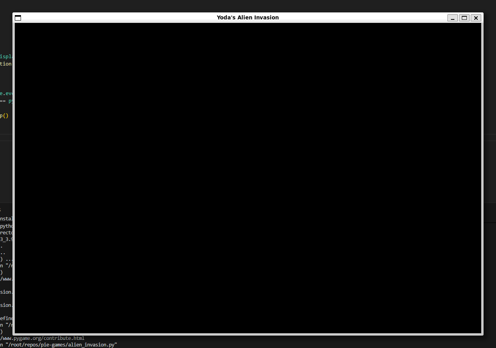

### Game Window

At runtime, the very first thing the game does at initialization is create the game window for the player to see. That is why when we run the command 'pygame.init()' function,it initializes the background settings that Pygame needs to work properly. The 'pygame.display.set_mode((x,y))' creates the dimensions for the display window of the game. Inside that window we will have the game graphical elements. 

<h1>'def __init__(self):'</h1>